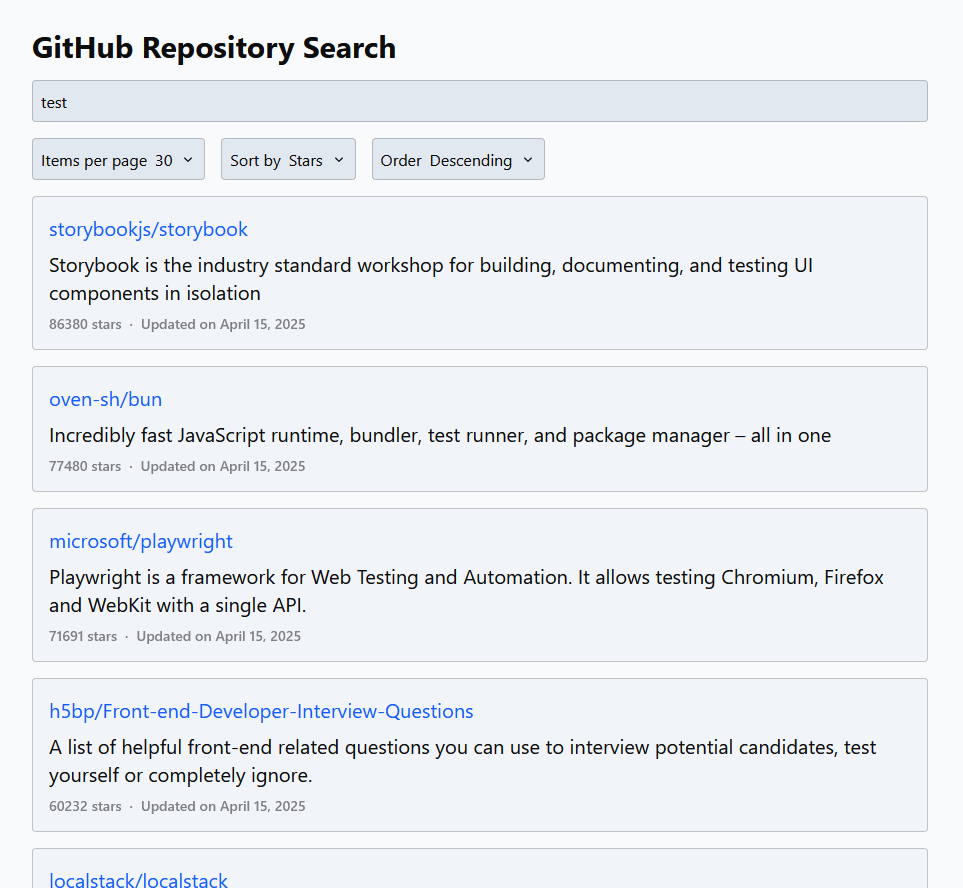
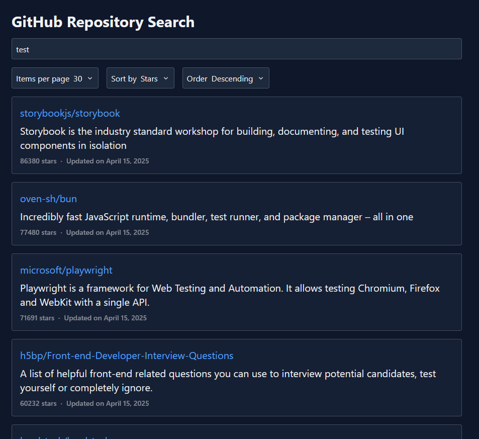

# React Practice - GitHub Repository Search Page

Implementation of [this](https://reactpractice.dev/exercise/build-a-github-repositories-search-page-with-sorting-and-pagination/)
reactpractice.dev exercise. This one was a lot of fun! 😄 On top of getting to
practice more with [Tailwind](https://tailwindcss.com/), I was able to try out
[Storybook's MSW integration](https://storybook.js.org/docs/writing-stories/mocking-data-and-modules/mocking-network-requests#set-up-the-msw-addon).
I've used MSW before, but I didn't know Storybook had an official addon for it.
It works really well!

## Screenshots

